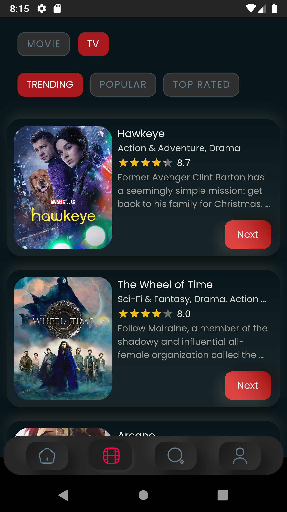
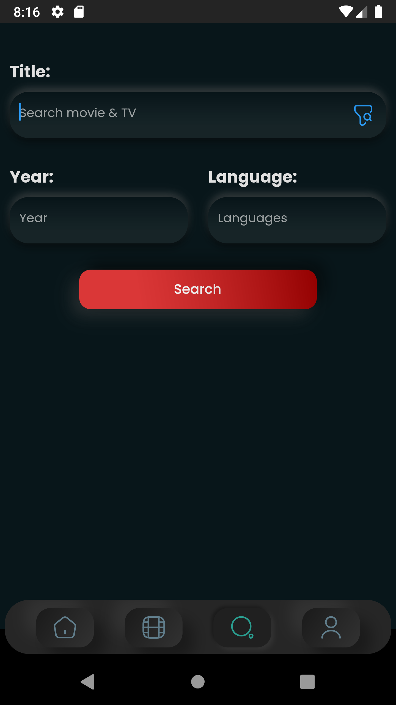
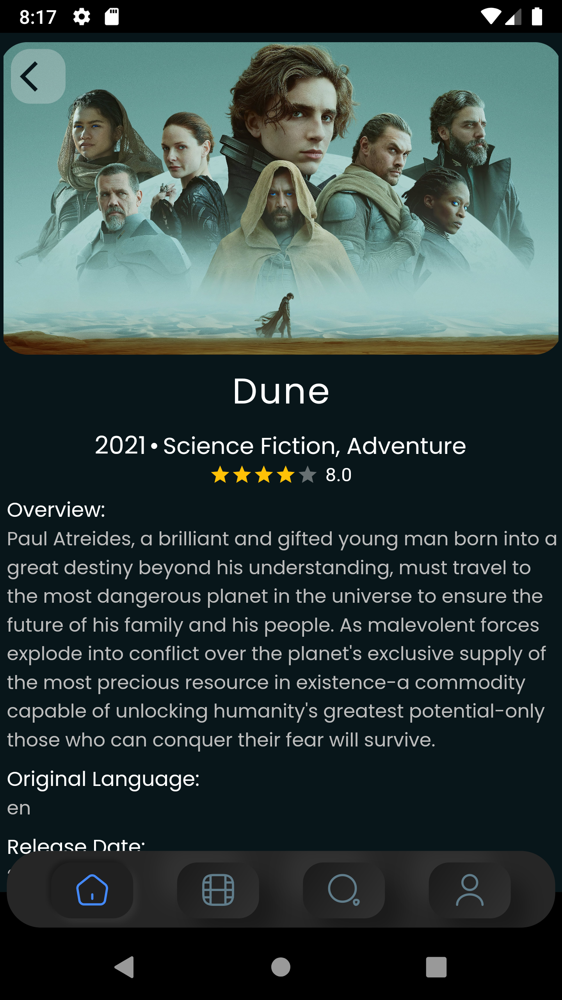

# movich-flutter

A Flutter project for getting to know which movie you would like to watch with various of lists.

**_combine (which + movie) => movich_**

The aim of this project is to provide flutter knowledge to get familiar with the flutter framework.
So the number of users that have been installed is not so important.

I would be grateful for any criticism or suggestion that makes the project move forward.

## Inspiration

The inspiration UI is from dribbble, which mentions these links:

[Dribbble Link 1](https://dribbble.com/shots/14791304-Movies-app-design)
[Dribbble Link 2](https://dribbble.com/shots/15189116-Cinema-App)
[Dribbble Link 3](https://dribbble.com/shots/15248148-Cinema-App-P1)

## Screenshots

<table>
<tr>
<td>

</td>
<td>

</td>
<td>

</td>
</tr>
<tr>
<td>

</td>
<td>

</td>
</tr>
</table>

## Tasks

Some that needed to be done:

#### List Screen

- [ ] Change filter tag to neumorphism style

#### Search Screen

- [ ] Fix searching 

#### Profile Screen

- [ ] Complete Edit Profile screen
- [ ] Show liked media
- [ ] Add profile photo

## Help

If Lists were not loaded or can't signIn/SignUp, You may use a VPN because Firebase or API that catch data is not available in your country.
