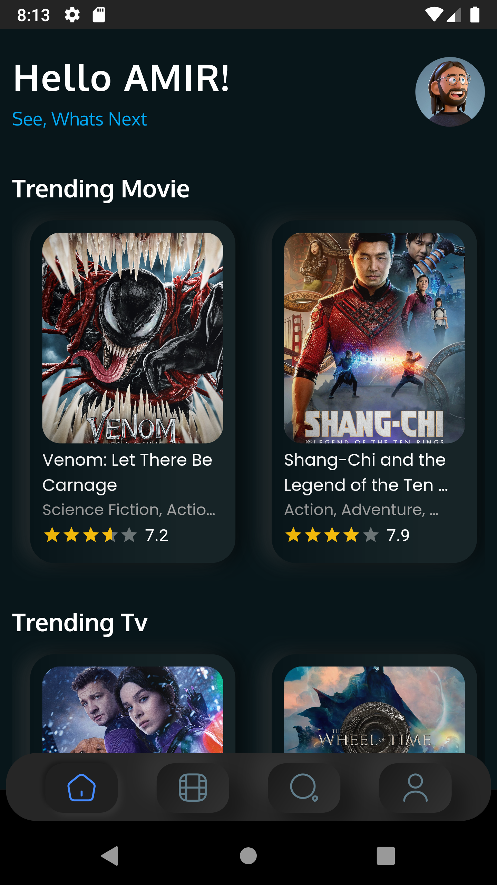
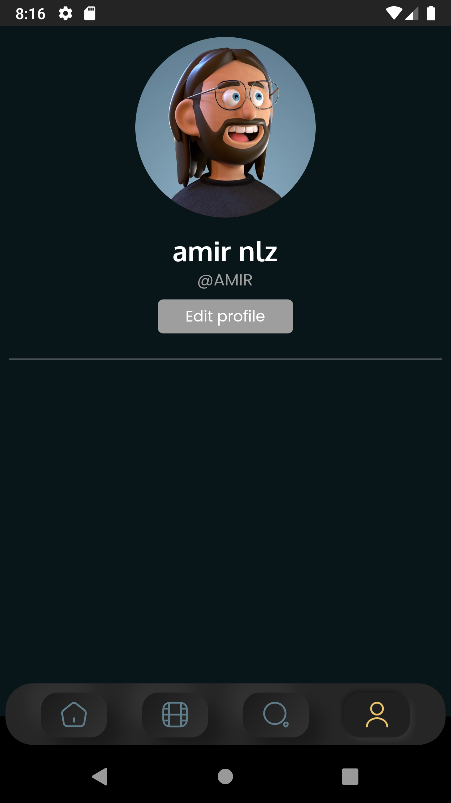

# movich-flutter

A Flutter project for getting to know which movie you would like to watch with various of lists.

**_combine (which + movie) => movich_**

The aim of this project is to provide flutter knowledge to get familiar with the flutter framework.
The number of users that have been installed is not as important as criticism about code quality and performance.

## Inspiration

The inspiration UI is from dribbble, which mentions these links:

[Dribbble Link 1](https://dribbble.com/shots/14791304-Movies-app-design)
[Dribbble Link 2](https://dribbble.com/shots/15189116-Cinema-App)
[Dribbble Link 3](https://dribbble.com/shots/15248148-Cinema-App-P1)

## Screenshots

<table>
<tr>
<td>

</td>
<td>

</td>
<td>

</td>
</tr>
<tr>
<td>

</td>
<td>

</td>
</tr>
</table>

## Tasks

#### Home Screen

- [x] Create home Screen
- [x] Create horizontal scroll lists
- [x] Create movie lists
- [x] Create tv lists
- [x] Move to the next screen
- [x] Sync Info with current user

#### List Screen

- [x] Create list screen
- [x] Create filter tags
- [x] Create vertical scroll lists
- [x] Add page numbers
- [ ] Change filter tag to neumorphism style

#### Search Screen

- [x] Create search screen
- [x] Add search elements that needs

#### Profile Screen

- [x] Create profile screen
- [x] Sync with logged/signed in user
- [x] Edit profile screen
- [ ] Complete Edit Profile screen

#### UI Design and other tasks

- [x] Create a UI for the app
- [x] Set dark mode
- [ ] Set the app icon
- [x] Change theme style to neumorphism styles
- [x] Add an animated splash screen
- [x] Create loging/signup screens
- [x] Sync with firebase
- [x] Fix overflow issue when keyboard is shown on login/register screen

## Help

If Lists were not loaded or can't signIn/SignUp, You may use a VPN because Firebase or API that catch data is not available in your country.
